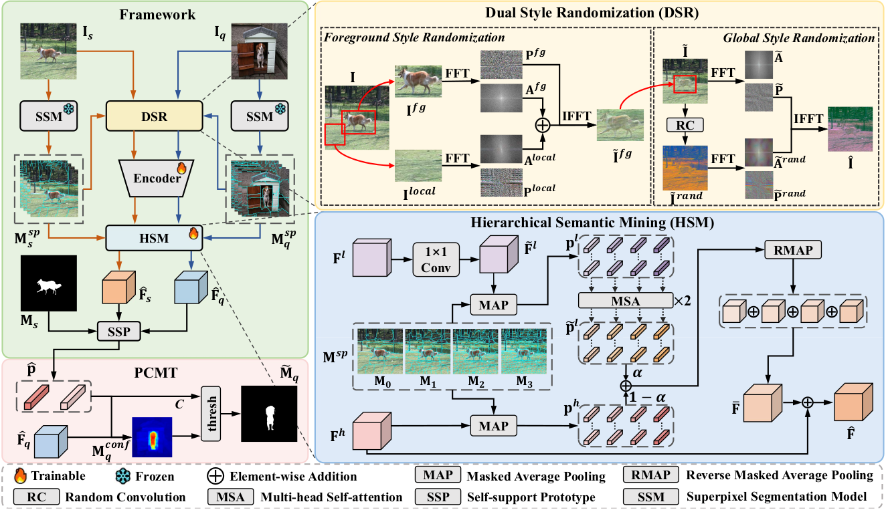

# [AAAI 2026] Bridging Granularity Gaps: Hierarchical Semantic Learning for Cross-domain Few-shot Segmentation
[](https://arxiv.org/abs/2511.12200)

Official code for AAAI 2026 paper: Bridging Granularity Gaps: Hierarchical Semantic Learning for Cross-domain Few-shot Segmentation



## Abstract
Cross-domain Few-shot Segmentation (CD-FSS) aims to segment novel classes from target domains that are not involved in training and have significantly different data distributions from the source domain, using only a few annotated samples, and recent years have witnessed significant progress on this task. However, existing CD-FSS methods primarily focus on style gaps between source and target domains while ignoring segmentation granularity gaps, resulting in insufficient semantic discriminability for novel classes in target domains. Therefore, we propose a Hierarchical Semantic Learning (HSL) framework to tackle this problem. Specifically, we introduce a Dual Style Randomization (DSR) module and a Hierarchical Semantic Mining (HSM) module to learn hierarchical semantic features, thereby enhancing the model's ability to recognize semantics at varying granularities. DSR simulates target domain data with diverse foreground-background style differences and overall style variations through foreground and global style randomization respectively, while HSM leverages multi-scale superpixels to guide the model to mine intra-class consistency and inter-class distinction at different granularities. Additionally, we also propose a Prototype Confidence-modulated Thresholding (PCMT) module to mitigate segmentation ambiguity when foreground and background are excessively similar. Extensive experiments are conducted on four popular target domain datasets, and the results demonstrate that our method achieves state-of-the-art performance.


## Datasets
You can follow [PATNet](https://github.com/slei109/PATNet) to prepare the source domain and target domain datasets.

### Source domain: 

* **PASCAL VOC2012**:

    Download PASCAL VOC2012 devkit (train/val data):
    ```bash
    wget http://host.robots.ox.ac.uk/pascal/VOC/voc2012/VOCtrainval_11-May-2012.tar
    ```
    Download PASCAL VOC2012 SDS extended mask annotations from [[Google Drive](https://drive.google.com/file/d/10zxG2VExoEZUeyQl_uXga2OWHjGeZaf2/view?usp=sharing)].

### Target domains: 

* **Deepglobe**:

    Home: http://deepglobe.org/

    Direct: https://www.kaggle.com/datasets/balraj98/deepglobe-land-cover-classification-dataset
    
    Preprocessed Data: https://drive.google.com/file/d/10qsi1NRyFKFyoIq1gAKDab6xkbE0Vc74/view?usp=sharing

* **ISIC2018**:

    Home: http://challenge2018.isic-archive.com

    Direct (must login): https://challenge.isic-archive.com/data#2018
    
    Class Information: data/isic/class_id.csv

* **Chest X-ray**:

    Home: https://www.ncbi.nlm.nih.gov/pmc/articles/PMC4256233/

    Direct: https://www.kaggle.com/datasets/nikhilpandey360/chest-xray-masks-and-labels

* **FSS-1000**:

    Home: https://github.com/HKUSTCV/FSS-1000

    Direct: https://drive.google.com/file/d/16TgqOeI_0P41Eh3jWQlxlRXG9KIqtMgI/view

## Pretrained model
Download the model weights of [ResNet-50](https://drive.google.com/file/d/11yONyypvBEYZEh9NIOJBGMdiLLAgsMgj/view) and [ViT-B/16-384](https://storage.googleapis.com/vit_models/augreg/B_16-i1k-300ep-lr_0.001-aug_medium1-wd_0.1-do_0.0-sd_0.0--imagenet2012-steps_20k-lr_0.01-res_384.npz), and organize them as follows.
> ```bash
> ~/.cache/torch/hub/checkpoints/
>       resnet50.pth
>       B_16-i1k-300ep-lr_0.001-aug_medium1-wd_0.1-do_0.0-sd_0.0--imagenet2012-steps_20k-lr_0.01-res_384.npz
> ```

## Run the code
### Generating Spixel Masks
> ```bash
> python generate_spixel.py --dataset lung
> ```

### Training
> ```bash
> CUDA_VISIBLE_DEVICES=0 python -W ignore train.py --dataset lung --datapath ./datasets --backbone vit_b --size 480 --batch-size 8 --episode 6000 --shot 1 --perturb
> ```

### Testing
> ```bash
> CUDA_VISIBLE_DEVICES=0 python -W ignore test.py --dataset lung --datapath ./datasets --backbone vit_b --size 480 --checkpoint output/vit_b/1shot/exp0/best_model.pth --batch-size 1 --shot 1
> ```


## Acknowledgement
Our code is built upon the foundations of [SSP](https://github.com/fanq15/SSP), [FPTrans](https://github.com/Jarvis73/FPTrans/tree/main), [PATNet](https://github.com/slei109/PATNet), [CDSpixel](https://github.com/rookiie/CDSpixel), [ABCDFSS](https://github.com/Vision-Kek/ABCDFSS) and [GPRN](https://github.com/CVL-hub/GPRN), we appreciate the authors for their excellent contributions!
